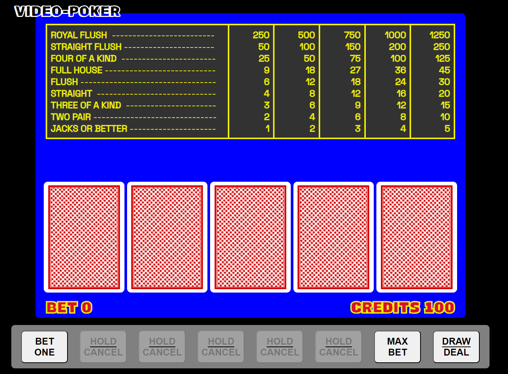

# PROJECT #1 - Video Poker
Video poker first became commercially viable when it became economical to combine a television like monitor with a solid state central processing unit and first appeared in the mid 1970s. Thoughout the 1980s video poker became increasingly popular in casinos and nowadays is a popular option in many casinos. My project is a remake of the classic casino game video poker with an increased payout rate for your gaming enjoyment. 

### Getting Started:
[Click here](https://dpockyyy.github.io/video-poker/) to play the game!
- play begins by placing a bet of one or more credits and pressing the 'deal' button
- the player is then given 5 cards (like five-card draw) and has the opportunity to discard one or more of them in exchange for new ones drawn from the same virtual deck.
- after the draw, the machine pays out if the hand played matches one of the winning combinations which are posted in the pay table. 
- [List of poker hands](https://en.wikipedia.org/wiki/List_of_poker_hands)

### Technologies used
- JavaScript
- HTML
- CSS

### Next Steps
- smooth out animations
- fix minor bugs when reaching a 0 credit balance (should be quite hard to go broke)
- also some bugs if user clicks buttons too fast...
- implement credit ticking animation after winning a hand